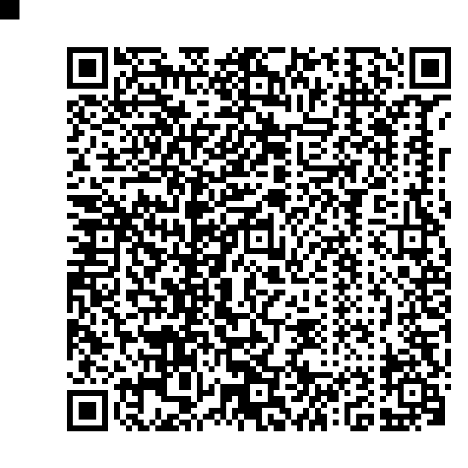

# Coding / Découpé

## Challenge
Lors d'une interpellation, nous avons réussi à récupérer un disque dur. Hélas, un mécanisme de protection fait main a détruit un document qui se trouvait dessus ! Seriez-vous capable de le reconstituer ?

## Inputs
- ZIP file: [decoupe.zip](./decoupe.zip)

## Solution
Extracing the ZIP file gives us 576 little images of 33x33 size, that look like pieces of a QR code. So we probably need to reassemble them. Note that `576 = 24*24`, which gives us a square. Nice. I used following Python code to do it:
```python
import sys
from PIL import Image

# creates a new empty image
big_img = Image.new('RGB', (33*24,33*24))

for i in range(1, 24*24):
    small_img = "output/" + str(i) + ".png"
    data = Image.open(small_img)
    big_img.paste(data, (33*(i%24), 33*(i//24)))

big_img.save('sol.png')
```

Here is the reconstructed image, which is indeed a QR code encoding the flag:


## Python code
Complete solution in [sol.py](./sol.py)

## Flag
404CTF{M4n1PuL4T10N_d'1M4g3S_F4c1L3_n0N?}
