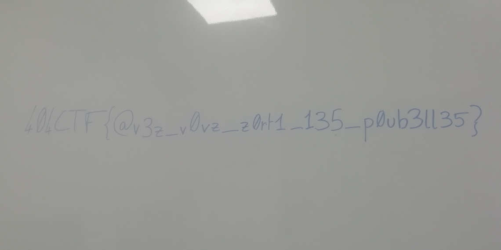

#  Forensics / Floppy

## Challenge
Une ancienne planque de Hallebarde vient d'être découverte par le Service Action. Elle semble avoir été abandonnée dans les années 90 au moins, et ne nous a pour le moment pas fourni de renseignements utiles. Nous avons néanmoins pu récupérer une disquette qui y avait été oubliée. Elle ne semble pas contenir quoi que ce soit d’intéressant à première vue, mais un fichier semble manquer à en croire la nomenclature des fichiers. Pourriez-vous tenter de le récupérer ?

## Inputs
- A floppy disk image `floppy.img` (not provided here)

## Solution
Let's mount the floppy disk and inspect it:
```console
$ sudo mount -o loop floppy.img /media/floppy
$ ll /media/floppy
total 201
-rwxr-xr-x 1 root root 70856 May  7 04:58 IMG_0001.jpg
-rwxr-xr-x 1 root root 49181 May  7 04:58 IMG_0002.jpg
-rwxr-xr-x 1 root root 68512 May  7 04:59 IMG_0004.jpg
-rwxr-xr-x 1 root root 15560 May  7 04:59 IMG_0005.jpg
```
This suggests that `IMG_0003.jpg` is missing or has been deleted.

Running command `strings` on `floppy.img` also suggests that `IMG_0003.jpg` has been deleted:
```console
$ strings floppy.img
(...)
..
MG_0003JPG
[Trash Info]
Path=IMG_0003.jpg
DeletionDate=2022-05-07T05:02:38
[Trash Info]
Path=.Trash-1000
DeletionDate=2022-05-07T05:02:58
```

Let's run `photorec` to try and recover it. Here is what `photorec` recovered:
```console
$ ll ./recup_dir.1
total 232
-rw-r--r-- 1 root root 70856 May 17 01:21 f0000034.jpg
-rw-r--r-- 1 root root 49181 May 17 01:21 f0000173.jpg
-rw-r--r-- 1 root root 11983 May 17 01:21 f0000270.jpg
-rw-r--r-- 1 root root 68512 May 17 01:21 f0000294.jpg
-rw-r--r-- 1 root root 15560 May 17 01:21 f0000428.jpg
-rw-r--r-- 1 root root    64 May 17 01:21 f0000462.ini
-rw-r--r-- 1 root root    63 May 17 01:21 f0000463.ini
-rw-r--r-- 1 root root  3344 May 17 01:21 report.xml
```

The flag waits for us in the recovered `f0000270.jpg` image:


## Flag
404CTF{@v3z_v0vz_z0rt1_135_p0ub3ll35}
