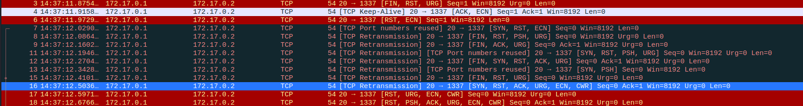

#  Forensics / Hackllebarde ransomware [1/4]

## Challenge :star:
Alerte, nous sommes attaqués ! Un ransomware vient de frapper l'infrastructure de notre centre de commandement ! Hors de question de payer la rançon.
Comme vous êtes notre meilleur élément, nous vous chargeons de la gestion de cette crise. Nous pourrions faire une simple réinstallation avec nos sauvegardes, mais nous souhaitons récupérer avant tout le plus d'informations. Avant de nous intéresser à l'origine de ce malware, nous devons trouver si des informations confidentielles ont été exfiltrées afin de prendre les mesures appropriées. Nous avons pu enregistrer un trafic réseau suspect, mais impossible de savoir ce qu'il contient. Jetez-y un oeil !

## Inputs
- PCAP file: [ransomware1.pcapng](./ransomware1.pcapng)

## Solution
The PCAP file shows two TCP streams, no data, tons of retransmissions. What sticks out is the variety of `TCP flags`. It's like christmas !


Let's extract those `TCP flags` and see whether we can make some sense out of it:

```console
$ tshark -r ransomware1.pcapng -Y 'ip.src==172.17.0.1 and tcp' -T fields -e 'tcp.flags' > flags.txt
$ head flags.txt
0x00000025
0x00000050
0x00000044
0x00000046
0x0000002d
0x00000031
0x0000002e
0x00000037
0x0000000a
0x00000025
```

Let's retain and concatenate the last byte for each one, like so: `255044462d312e370a25(...)` in `flags2.txt`.

Then, we use python's `binascii.unhexlify` on this hex string and write the output in `flags.dec`:
```python
import binascii

with open('flags2.txt', 'rb') as f_in:
    contents = f_in.readline().strip()
    hex_ = binascii.unhexlify(contents)

with open('flags.dec', 'wb') as f_out:
    f_out.write(hex_)
```

We end up with a promising PDF file!
```console
$ file flags.dec
flags.dec: PDF document, version 1.7, ASCII text, with very long lines
$ mv flags.dec flags.pdf
```

Here is the extracted PDF file: [flags.pdf](./flags.pdf). The flag waits for us in the last page:


## Flag
404CTF{L3s_fL4gS_TCP_Pr1S_3n_fL4G}
