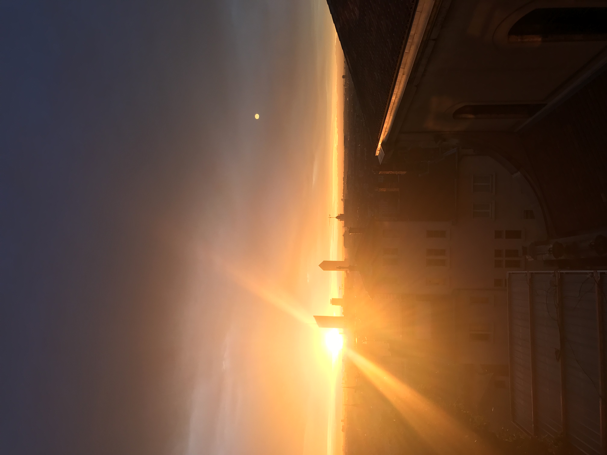

# OSINT / A l'aube d'un échange

## Challenge
Nouvelle recrue ! Nous avons besoin de toi par ici. Un de nos agents vient d'intercepter une courte conversation téléphonique entre deux agents de Hallebarde. Un important échange de documents confidentiels doit avoir lieu et pour indiquer l'endroit du rendez-vous, l'un des agents ennemis a envoyé la photo ci-dessous à son collègue tout en précisant ceci :

Quel beau lever de soleil n'est-ce pas ? J'attendrai dans la rue qui sépare le bâtiment au premier plan de ceux au second plan. Rendez-vous ce soir, 22h00.

Nous avons moins d'une journée pour découvrir le nom de ladite rue et empêcher l'échange !

Format du flag : 404CTF{md5 du nom complet de la rue} Le nom de la rue doit être en minuscule, inclure le type de rue ( ex : avenue, rue, boulevard... ), sans accents, sans abréviation, et tous les espaces doivent être remplacés par des tirets. Par exemple : si la rue est l'Avenue de Saint-Mandé à Paris, le flag correct est 404CTF{129af9edde5659143536427f9a5f659a}.

## Inputs


## Solution
The photo was taken in French city Lyon: we can see the tower of the `Part-Dieu` railway station (the stick-shaped tower) and the `Incity` tower next to it (the rubber-shaped tower).
[Tour de la Part-Dieu à Lyon](https://fr.wikipedia.org/wiki/Tour_Part-Dieu#/media/Fichier:Part-Dieu-Incity-Lyon.jpg)

We know that the photo was taken during sunrise, which takes place on the East, so the photographer was on the West of the two towers. In the foreground, we distinguish the steeples of a church. Looking in a map tells us this is the `Saint-Nizier` church:
[Eglise Saint-Nizier](https://fr.wikipedia.org/wiki/%C3%89glise_Saint-Nizier_de_Lyon#/media/Fichier:%C3%89glise_Saint-Nizier,_Lyon.jpg)

So the photo was presumably taken from `Fourvière`, on a street that looks roughly oriented north-south. Let's look at a plan to find out it could be taken from `Montée Saint-Barthélémy`:


Walking in `Montée Saint-Barthélémy` with `Google Street`, we found out the building in the foreground of the photo at the number 17:


Let's finally `md5sum` the correct formated street name `montee-saint-barthelemy` to get the flag:
```console
$ echo -n 'montee-saint-barthelemy' | md5sum
eb66c65861da9fe667f26667b3427d2c
```

## Flag
404CTF{eb66c65861da9fe667f26667b3427d2c}
