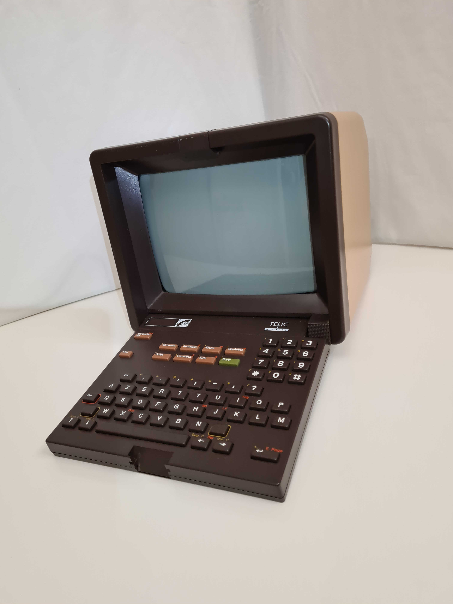

# OSINT / Equipement désuet

## Challenge
Un de nos agents a retrouvé un équipement qui a été utilisé pour communiquer des données sensibles. Mais de quoi s'agit-il ? Il faudrait trouver la date d'arrêt de cet équipement en France, pour savoir quelle piste privilégier pour la suite de l'enquête.

Format du flag: `404CTF{jj_mm_aaaa}``

## Inputs

## Solution
This is a french `Minitel`: The wikipedia page [Minitel](https://fr.wikipedia.org/wiki/Minitel) tells us that the service has been stopped in 2012, June 30th.

## Flag
404CTF{30_06_2012}
